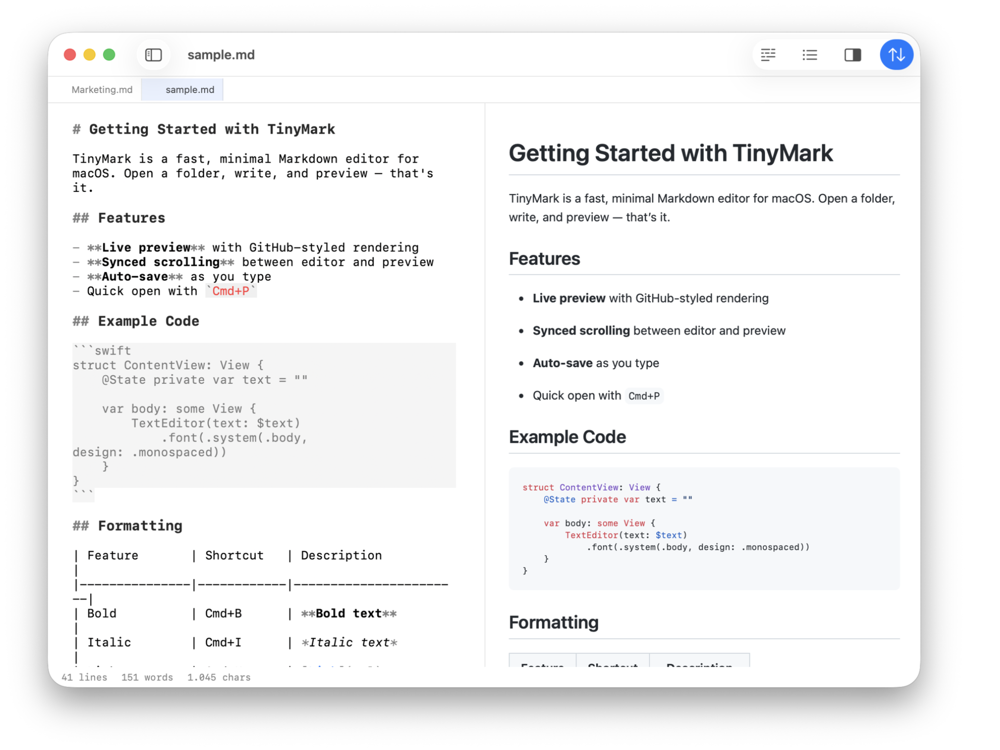

# TinyMark

A minimal, fast Markdown editor for macOS.




## Features

- **Three-panel layout** — file sidebar, editor, and live preview
- **Syntax highlighting** — headings, bold, italic, code, links, images
- **Live preview** — GitHub-styled HTML with synced scrolling
- **Directory browsing** — navigate folders, subdirectories, and files
- **Quick open** — fuzzy file finder (Cmd+P)
- **Auto-save** — saves as you type with dirty-file indicators
- **Find & replace** — native macOS find bar (Cmd+F)
- **Markdown shortcuts** — bold (Cmd+B), italic (Cmd+I), link (Cmd+K), code (Cmd+Shift+K)
- **Image drag & drop** — drop images into the editor to insert relative markdown paths
- **Line numbers** — optional gutter with current line highlight
- **Smart pairs** — auto-close `*`, `` ` ``, `[`, `(`, `"`
- **Tab indentation** — indent/outdent list items with Tab/Shift+Tab
- **Frontmatter display** — YAML frontmatter rendered as a table in preview
- **Multiple windows** — each window has independent state
- **Font size control** — Cmd+/Cmd- to adjust, Cmd+0 to reset
- **Light & dark mode** — follows system appearance
- **Status bar** — line count, word count, character count, reading time
- **On-device AI** — Cmd+K to ask questions about your document (CoreML, fully offline)
- **Open from Finder** — double-click `.md` or `.txt` files to open in TinyMark

## Requirements

- macOS 26.0+
- Xcode 26+ (to build)

## Build

```bash
xcodebuild clean build \
  -project TinyMark.xcodeproj \
  -scheme TinyMark \
  -configuration Release \
  -derivedDataPath /tmp/tinybuild/tinymark \
  CODE_SIGN_IDENTITY="-"

cp -R /tmp/tinybuild/tinymark/Build/Products/Release/TinyMark.app /Applications/
```

## Keyboard Shortcuts

| Shortcut | Action |
|---|---|
| Cmd+N | New file |
| Cmd+Shift+N | New window |
| Cmd+O | Open folder |
| Cmd+S | Save |
| Cmd+Shift+S | Save as |
| Cmd+P | Quick open |
| Cmd+F | Find |
| Cmd+G | Find next |
| Cmd+Shift+G | Find previous |
| Cmd+B | Bold |
| Cmd+I | Italic |
| Cmd+K | AI assistant |
| Cmd+Shift+K | Inline code |
| Opt+↑ / Opt+↓ | Move line up/down |
| Cmd+Shift+D | Duplicate line |
| Cmd+L | Select line |
| Cmd+Enter | Insert line below |
| Cmd+Shift+Enter | Insert line above |
| Cmd+/ | Toggle comment |
| Cmd+= / Cmd+- | Font size |
| Cmd+0 | Reset font size |
| Opt+Z | Toggle word wrap |
| Opt+P | Toggle preview |
| Opt+L | Toggle line numbers |
| Tab / Shift+Tab | Indent/outdent list |
| Enter | Auto-indent with list continuation |

## Tech

Built with SwiftUI, NSTextView, WKWebView, and [swift-markdown](https://github.com/apple/swift-markdown).

## Part of [TinySuite](https://tinysuite.app)

Native macOS micro-tools that each do one thing well.

| App | What it does |
|-----|-------------|
| **TinyMark** | Markdown editor with live preview |
| [TinyTask](https://github.com/michellzappa/tinytask) | Plain-text task manager |
| [TinyJSON](https://github.com/michellzappa/tinyjson) | JSON viewer with collapsible tree |
| [TinyCSV](https://github.com/michellzappa/tinycsv) | Lightweight CSV/TSV table viewer |
| [TinyPDF](https://github.com/michellzappa/tinypdf) | PDF text extractor with OCR |
| [TinyLog](https://github.com/michellzappa/tinylog) | Log viewer with level filtering |
| [TinySQL](https://github.com/michellzappa/tinysql) | Native PostgreSQL browser |

## License

MIT
